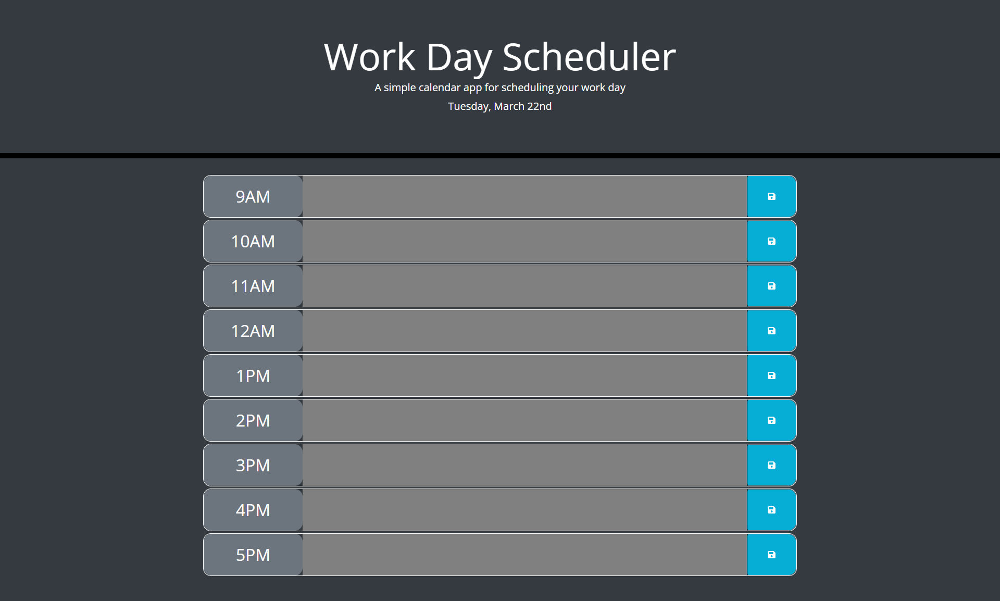

# WorkDayScheduler
## Description

Welcome to the Work Day Scheduler repository!

The link below will take you to the website hosting the scheduling tool, where you will be able to keep track of your work day  

## Application Details

The application was built primarily using the jQuery library and JavaScript, with support from HTML and CSS to host the tool. Within jQuery, a number of click/blur event listeners were used to create text areas in each timeslot, to allow the user to click in, add an item to track, and click out of the textbox to continue using the tool. In addition, the tool was built to store the user's input in the timeslot ONLY if the save button is clicked, which stores the user data in an object in localStorage. Lastly, this application uses the moment.js library to present the current date within the website header and also apply different css styles dependent on whether the timeslot has passed, is current, or is in the future!

**Languages and Libraries Used**
- HTML
- CSS
- JavaScript
- jQuery
- Moment.js

**User Story:**  
AS AN employee with a busy schedule  
I WANT to add important events to a daily planner  
SO THAT I can manage my time effectively  

**Acceptance Criteria:**  
GIVEN I am using a daily planner to create a schedule  
WHEN I open the planner  
THEN the current day is displayed at the top of the calendar  
WHEN I scroll down  
THEN I am presented with time blocks for standard business hours  
WHEN I view the time blocks for that day  
THEN each time block is color-coded to indicate whether it is in the past, present, or future  
WHEN I click into a time block  
THEN I can enter an event  
WHEN I click the save button for that time block  
THEN the text for that event is saved in local storage  
WHEN I refresh the page  
THEN the saved events persist  

## Application Link and Screenshot
**Link to Application:**

[Work Day Scheduler](https://taimurhasan.github.io/WorkDayScheduler/)

**Screenshot of Application:**
